In this github page you can find some basic guidelines of how to install the software that we will use in the NoSQL class. Overall we will use

- MongoDB
- CouchDB
- Redis
- Python

You will find some instructions for windows and linux users (Ubuntu 20.04 based).

## MongoDB

MongoDB is a cross-platform document-oriented database program. Classified as a NoSQL database program, 
MongoDB uses JSON-like documents with optional schemas

There are several installation options.

### Atlas

Assuming that you have Compass installed or you will install it during this process.

This is the MongoDB cloud environment. 
- Go to https://www.mongodb.com/cloud/atlas
- Create an account or sign in.
- You will be prompt to create an organization (most likely).
  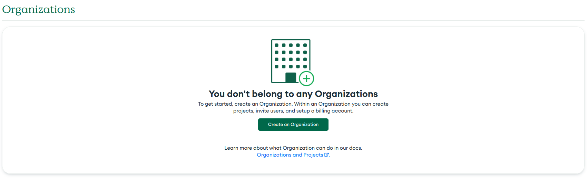
- Create one by giving a name (let other options as is)
  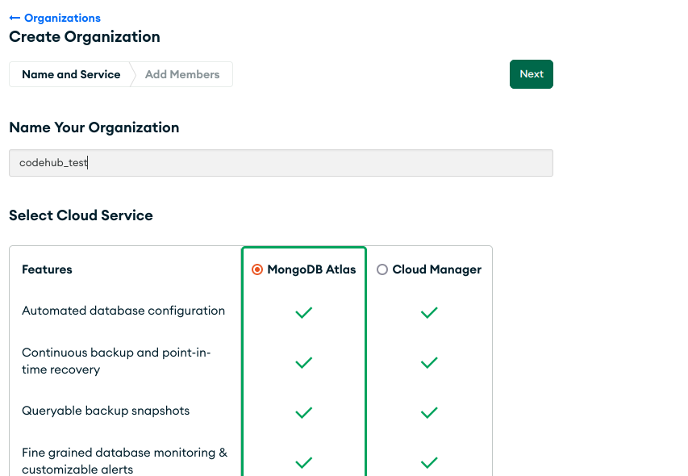
- Skip the Add members part by clicking Create Organization
  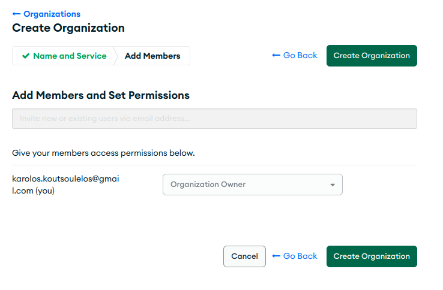
- When this is done you will be directed in Projects page. Pick New Project from the upper right corner and it will land you in new project creation. Add a name and click next
    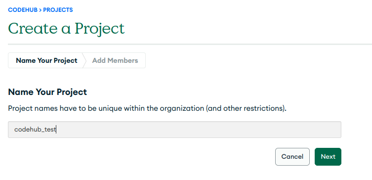
- Again skip the add members part and create the project
- Then you will be prompt to create a Database:
   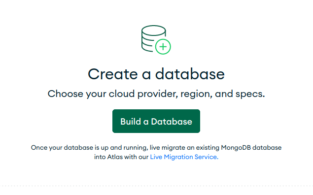
- Pick the free option:
    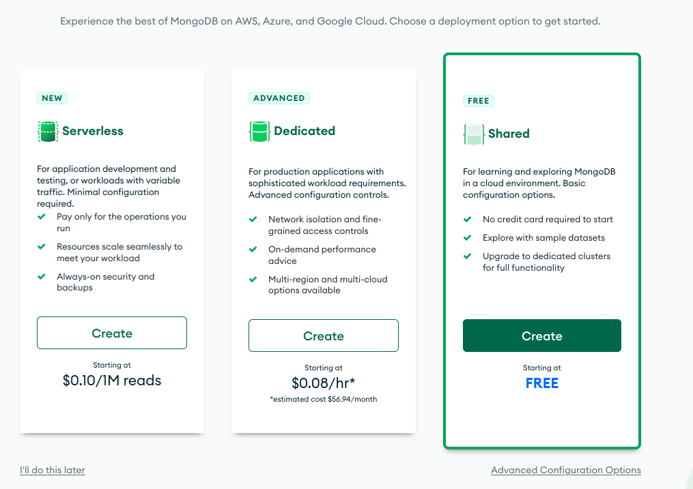
- In the next step you should pick Cloud provider, location etc. You can go with defaults, just check the mongo version in the bottom.
It should be 5.0.x
    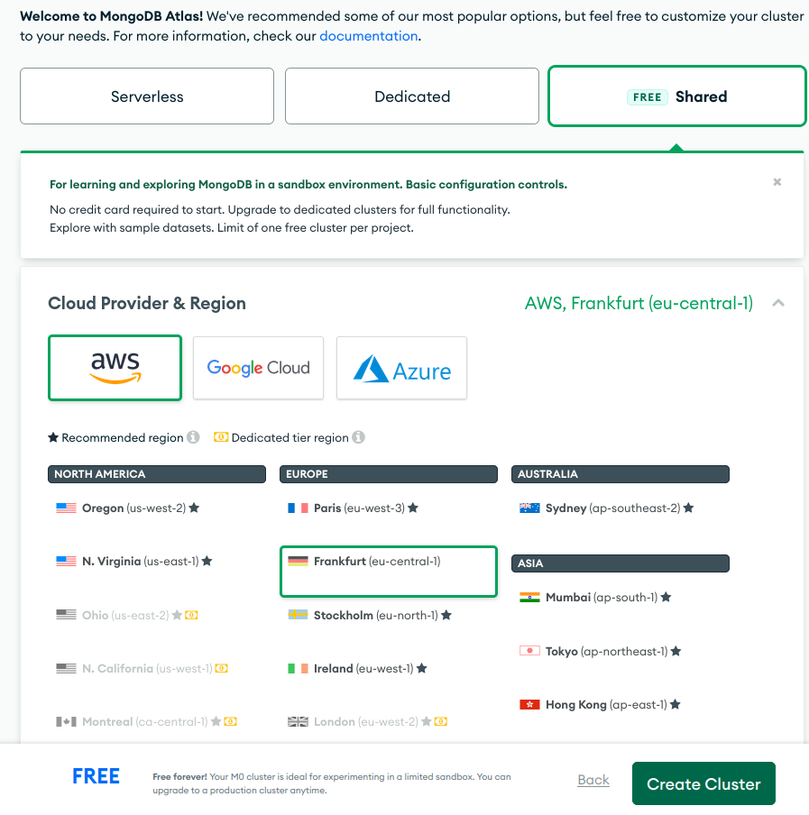

    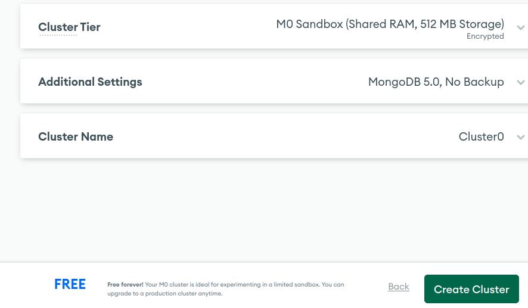
- When you will click create cluster Atlas will provision your instance and this may take some minutes.
- As soon as this is done you will be prompt to security quickstart.
- Add username and password (something simple that you can remember for instance user/user) and create the user.
    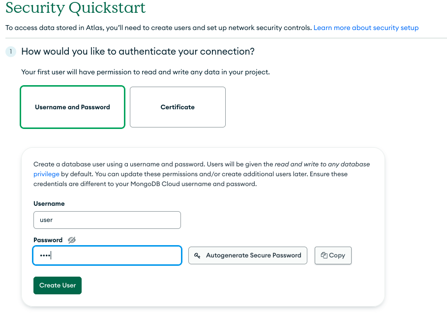
- Add 0.0.0.0 in IP access list, add the entry, and keep checked the My Local Environment option.
    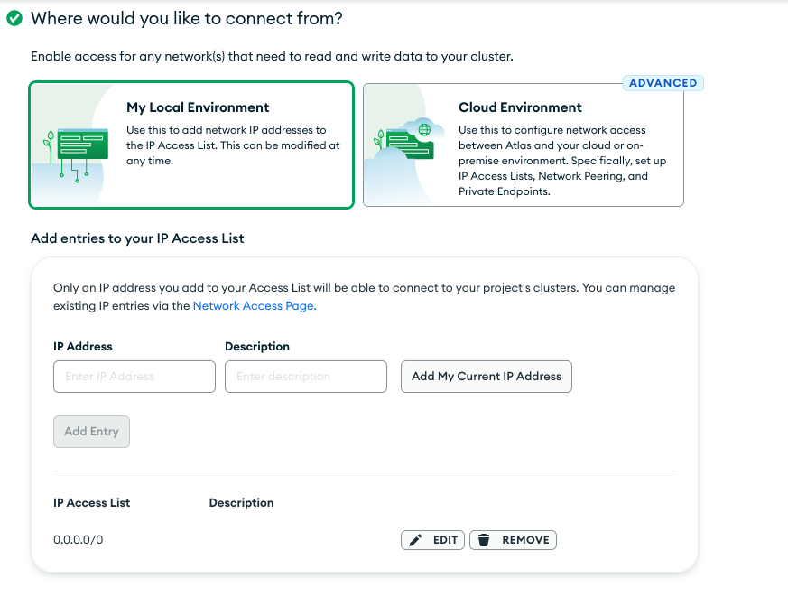
- You should be all setup now and get this prompt:
    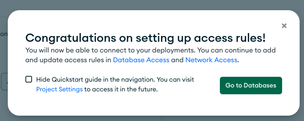
    Click to go to databases
- You will see something like this:
  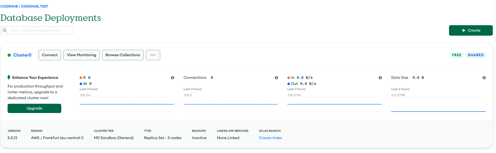
- Click on connect and select Compass from the popup
    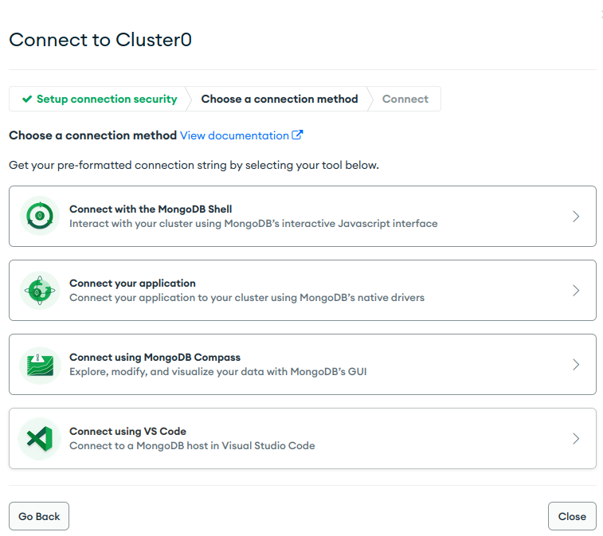
- If you do not have Compass already you can download it from here.
- Copy the given connection string
    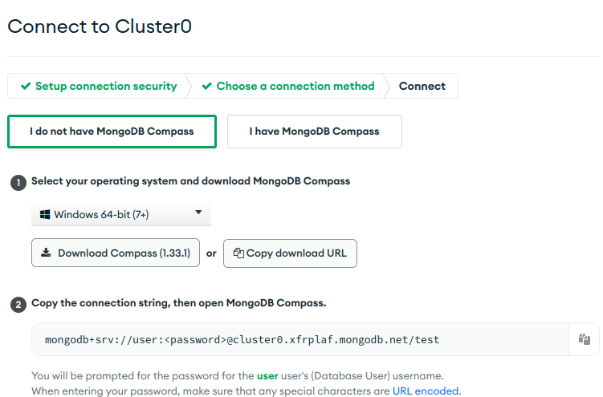
- Open compass application and in the connections create a connection with the given connection string
    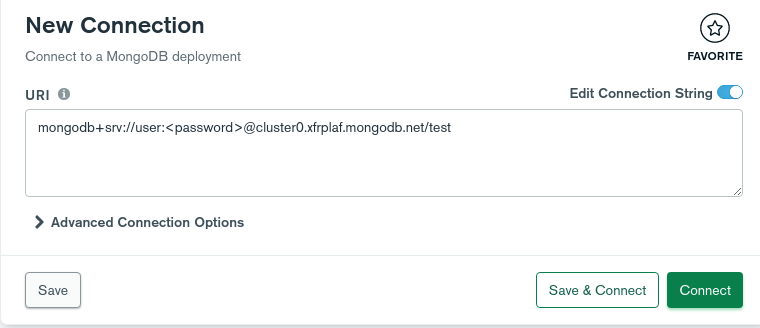
- Click connect and you should be able to see something like this:
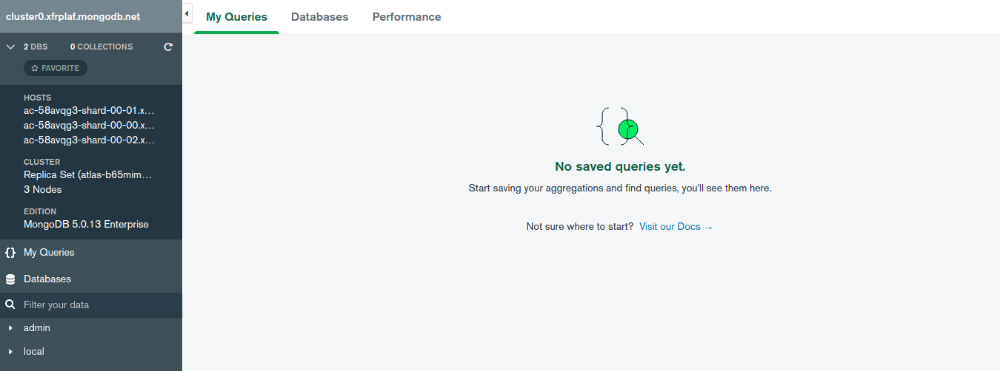
- That's it! You can now query the atlas cluster from your Compass.


### Local

Go to https://www.mongodb.com/try/download/community
- Download the package for your OS.
- If your package manager prompts to install mongo compass allow it.
- Go through with the default options
- As soon as this is done search for compass applciation and open it. 
- Use the default connection string to connect to your database

### Docker

- Pull the Mongo image: `docker pull mongo`
- Execute docker run: `docker run -d -p 27017:27017 --name test-mongo mongo:latest`
- Open Compass. use the default URI to connect `mongodb://localhost:27017`
- You should be able to see something like this:
    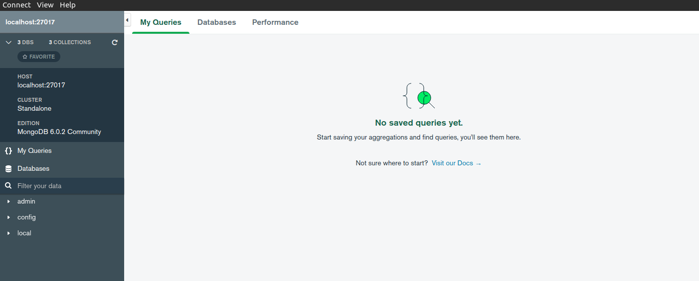

## Compass

- If you did not install Compass during the Mongo installation you can go here:
https://www.mongodb.com/try/download/compass and simply download it for your OS
- The first time it will run it will prompt for a connection string. The default will be `mongodb://localhost:27017`
- Use this if you have a local installation or if you run it in docker

## CouchDB

Apache CouchDB is an open-source document-oriented NoSQL database, implemented in Erlang. CouchDB uses multiple formats and protocols to store, transfer, and process its data, it uses JSON to store data, JavaScript as its query language using MapReduce, and HTTP for an API.

### Windows

- Go to https://couchdb.apache.org/#download and get the latest version 3.X (3.3.1 for example)
  
- Run the typical wizard and keep default values
- Add an admin/admin admin user when prompt

- Add a cookie value e.g "hello"


- Complete the installation wizard and restart you PC
- Search for `Fauxton` (CouchDB DBMS) and click on the result in the websites or go to your browser at http://localhost:5984/\_utils/index.html
 


- You should be able to see something like this after you login with your admin account.

 

### Linux

Follow instructions here: https://docs.couchdb.org/en/latest/install/unix.html#installation-using-the-apache-couchdb-convenience-binary-packages based on your distribution.

In the wizard that it will appear pick Standalone/ let the bind address as it is/ and optionally enter a password for your admin. If you do so please remember it.
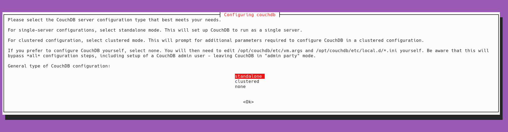

Visit Fauxton when the process ends at: http://127.0.0.1:5984/_utils/#

You can start/stop/restart couchdb with:

```cmd
sudo systemctl start couchdb
sudo systemctl stop couchdb
sudo systemctl restart couchdb
```

## Redis

Redis is a NO-SQL, key-value in-memory remote database that offers high performance, replication, and a unique data model.

### Windows

- Go to https://github.com/tporadowski/redis/releases and get the latest available MSI file.

  


**Important Note:** Please keep in mind that those are repos that are maintained from the community and they are intened for experimentation. This is the reasons which they are few versions behind. For the context of our class this versions discrepancy will not matter.
Alternatively you can use the WSL for Windows 10 and check the Linux section below. 

- Download the msi file. You can download alterantively the zip file but you will need to add manually environmental variables.
- Assuming that we are using the msi file, go over the typical installation wizard but do not forget to check the add to path variable.
  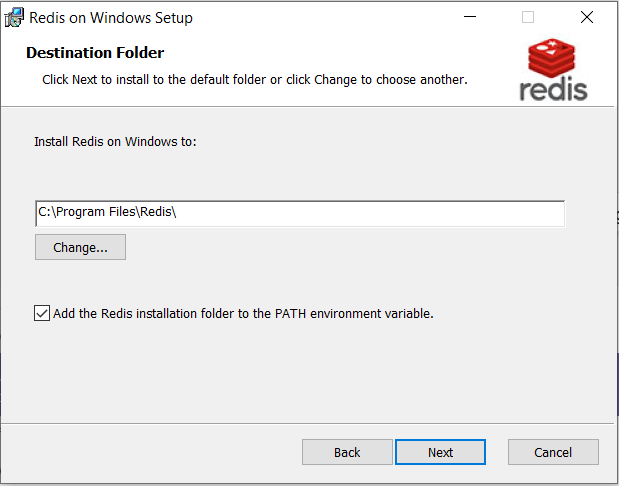

- Let the port number and the add exception as it is and continue with the default values in the wizard
- With msi installer the redis-server will automatically run in the background when the system starts
  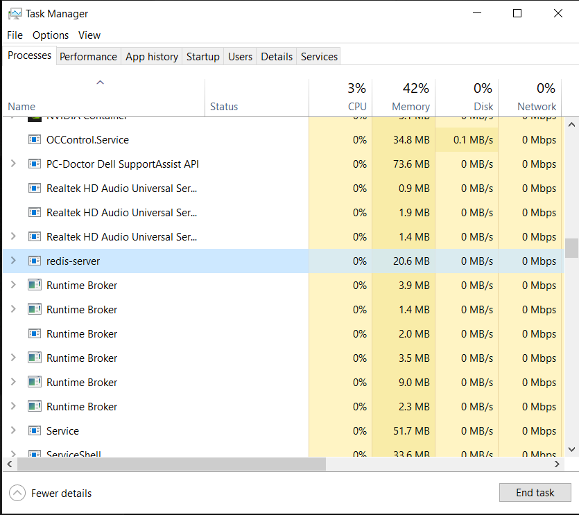

- In order to connect to the redis server open a cmd and type `redis-cli`. If everything is correct you will connect to your local instance and you will be able to start interacting with the redis server. You can try `SET key value` and it should return `OK` and then `GET key` to get the assigned value.

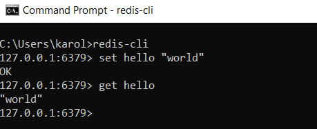

### Linux

- In you terminal execute:

```cmd
sudo apt update
sudo apt install redis-server
```

This will install redis with all its dependecies.

- Check that redis is running

```cmd
sudo systemctl status redis
```

- If it does not run try:

```cmd
sudo systemctl start redis
```

- You should be able now to use the redis-cli and connect to your local instance.

```cmd
redis-cli
127.0.0.1:6379> ping
PONG
127.0.0.1:6379>
```

## Python

We will need Python > 3.8 version in order to build some simple CRUD applications and demonstrate how to use NoSQL data stores within applications.
Linux and Mac users should have both 2.7.x and > 3.6.x versions installed by default on their machines. You can check your current version for both of them with:

```
python --version
python3 --version
```


Windows users please go at https://www.python.org/downloads/windows/ and get the appropriate file for your PC. Please note that during the installation you will be asked to add Python in Path. You should enable this option.


It allows you to run your files on cmd by:

```
python python_file.py
```

If you do not enable this you will be forced to use the full python path to execute your programs. (for example, it will be something like:
c:/users/username/program files/python36/python pytthon_file.py )
