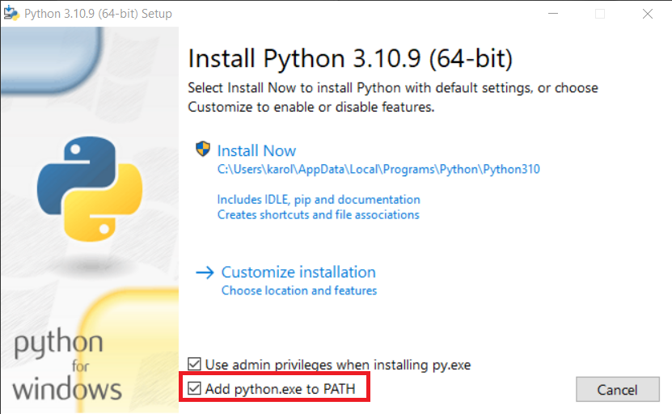
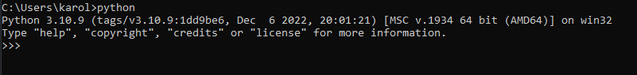

In this github page you can find some basic guidelines of how to install the software that we will use in the Python BI class. Overall we will use:

- Python
- SQL Server
- IDE of your choice (VS code pr PyCharm are recommended)

## Python

We will need Python > 3.8 version in order to build some simple CRUD applications and ETL pipelines during the course.

### Windows

Windows users please go at https://www.python.org/downloads/windows/ and get the appropriate file for your PC. Please note that during the installation you will be asked to add Python in Path. You should enable this option.



(Example installer first screen for Python 3.10. This is similar for all Python versions)

It allows you to run your files on cmd by:

```
python python_file.py
```

If you do not enable this you will be forced to use the full python path to execute your programs. (for example, it will be something like:
c:/users/username/program files/python36/python pytthon_file.py)

To check that Python has been installed properly, open a terminal and type `python`. This should start the interpreter and you should be able to see someting like this: 




### Linux

Linux and Mac users should have both 2.7.x and > 3.x.x versions installed by default on their machines. You can check your current version for both of them with:

```
python --version
python3 --version
```


## SQL Server

### Windows

Please check [here](https://github.com/codehub-learn/MS-SQL-Server-) for detailed instructions.

### Linux

Follow the guidelines in the official [site](https://www.microsoft.com/en-us/sql-server/sql-server-downloads) according to your distibution.
For example [here](https://docs.microsoft.com/en-us/sql/linux/quickstart-install-connect-ubuntu?view=sql-server-ver15) you can find details for installation in Ubuntu in the case you do not want to use containers.

### SQL Server IDE

For SQL IDE you can you [SSMS](https://docs.microsoft.com/en-us/sql/ssms/download-sql-server-management-studio-ssms?view=sql-server-ver15) or if it is not available for your OS you can go with [DBeaver](https://dbeaver.io/)

### Notes:

- Please make sure that your database is working properly and you can connect with it. You can try via your SQL IDE or via console.
- Alternatively you can try directly check it via a small python program:

First step would be to install the `pyodbc` python package:
```cmd 
pip install pyodbc
```

The expected behavior would be:

```cmd
Collecting pyodbc
     ━━━━━━━━━━━━━━━━━━━━━━━━━━━━━━━━━━━━━━━━ 66.0/66.0 kB 1.2 MB/s eta 0:00:00
Installing collected packages: pyodbc
Successfully installed pyodbc-4.0.35
```

Then create an app.py file and copy the below in it: 

```python
import pyodbc

cnxn_str = ("Driver={SQL Server};"
            "Server=DESKTOP-VS5KT7N;"
            "Database=master;"
            "Trusted_Connection=yes;")

try:
    cnxn = pyodbc.connect(cnxn_str)
    cursor = cnxn.cursor()
    cursor.execute("SELECT @@Version")
    print(cursor.fetchone())
    print("success")
except Exception as e:
    print(str(e))
    print(str(e.__class__))
``` 

Please note that this might need a few adjustments such as the server name in `Server=DESKTOP-VS5KT7N;` (essentially the PC name.) It may also require username and password if you are not in Windows. 

Execute the program with `python app.py`, and the expected behavior is something like:

```cmd
('Microsoft SQL Server 2022 (RTM) - 16.0.1000.6 (X64) \n\tOct  8 2022 05:58:25 \n\tCopyright (C) 2022 Microsoft Corporation\n\tDeveloper Edition (64-bit) on Windows 10 Pro 10.0 <X64> (Build 19044: )\n', ) 2022 Microsoft Corporation\n\tDeveloper Edition (64-bit) on Windows 10 Pro 10.0 <X64> (Build 19044: )\n', ) 2022 Microsoft Corporation\n\tDeveloper Edition (64-bit) on Windows 10 Pro 10.0 <X64> (Build 19044: )\n', )
success
``` 

## IDE

You can use any IDE that you prefer/are familiar with but it is recommended to also have installed VS Code.

- [VS Code](https://code.visualstudio.com/download)
- Python extention in VS Code [installation](https://code.visualstudio.com/docs/languages/python)
