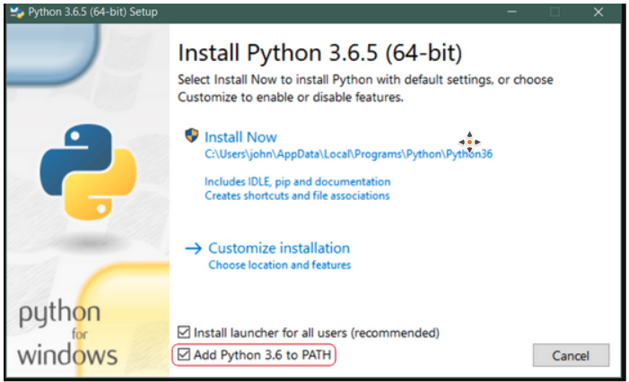
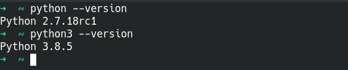

In this github page you can find some basic guidelines of how to install the software that we will use in the Python BI class. Overall we will use:

- Python
- SQL Server
- IDE of your choice (VS code recommended)

## Python

We will need Python > 3.5 version in order to build some simple CRUD applications and ETL pipelines during the course.

### Windows

Windows users please go at https://www.python.org/downloads/windows/ and get the appropriate file for your PC. Please note that during the installation you will be asked to add Python in Path. You should enable this option.



It allows you to run your files on cmd by:

```
python python_file.py
```

If you do not enable this you will be forced to use the full python path to execute your programs. (for example, it will be something like:
c:/users/username/program files/python36/python pytthon_file.py)

### Linux

Linux and Mac users should have both 2.7.x and > 3.6.x versions installed by default on their machines. You can check your current version for both of them with:

```
python --version
python3 --version
```



## SQL Server

### Windows

Please check [here](https://github.com/codehub-learn/MS-SQL-Server-) for detailed instructions.

### Linux

Follow the guidelines in the official [site](https://www.microsoft.com/en-us/sql-server/sql-server-downloads) according to your distibution.
For example [here](https://docs.microsoft.com/en-us/sql/linux/quickstart-install-connect-ubuntu?view=sql-server-ver15) you can find details for installation in Ubuntu in the case you do not want to use containers.

### SQL Server IDE

For SQL IDE you can you [SSMS](https://docs.microsoft.com/en-us/sql/ssms/download-sql-server-management-studio-ssms?view=sql-server-ver15) or if it is not available for your OS you can go with [DBeaver](https://dbeaver.io/)

### Notes:

- Please make sure that your database is working properly and you can connect with it. You can try via your SQL IDE or via console.

## IDE

You can use any IDE that you prefer/are familiar with but it is recommended to also have installed VS Code.

- [VS Code](https://code.visualstudio.com/download)
- Python extention in VS Code [installation](https://code.visualstudio.com/docs/languages/python)
